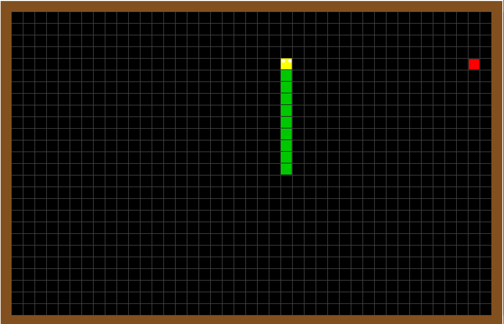

# Snake Game

A modern Snake Game built with Python using Pygame. The game features smooth gameplay, fullscreen mode, score tracking, high score saving, sound effects, and an intuitive user interface.

## Features

- Classic Snake gameplay
- Fullscreen mode
- Smooth snake movement
- Score tracking
- High score saving
- Random food generation
- Collision detection
- Sound effects
- Game Over screen
- Main menu
- Home screen
- Restart game option

## Technologies Used

- Python
- Pygame
- JSON
- Math Module

## Installation

### 1. Clone the repository

```bash
git clone https://github.com/YOUR_USERNAME/snake-game-python.git
```

### 2. Open the project folder

```bash
cd snake-game-python
```

### 3. Install dependencies

```bash
pip install -r requirements.txt
```

### 4. Run the game

```bash
python snake_game.py
```

## Project Screenshots

### Home Screen


### Main Menu


### Gameplay



### High Scores


### Game Over


## Controls

- **Arrow Keys** – Move the snake
- **Enter** – Start or Restart the game
- **Esc** – Exit the game (if implemented)

## Future Improvements

- Add multiple difficulty levels
- Add different themes
- Add pause/resume functionality
- Add power-ups
- Add animations
- Mobile version

## Learning Note

This project was created as part of my Python learning journey. I used AI as a learning and debugging assistant while building and understanding the game.

## Author

**Areeba**
